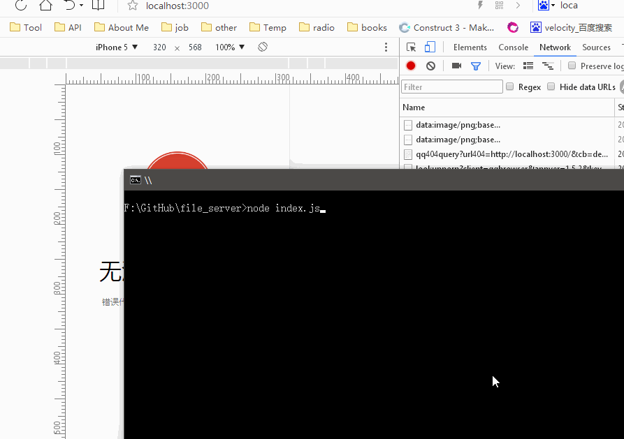

# file_server

一个基于浏览器可视化的文件服务器

简单模拟了微软`IIS`的一个文件浏览功能,`IIS`功能太多、太笨重,作为一个前端开发只需要简单的,查看`html`内容和处理`js`、`css`等链接

# 使用

> 1. `npm i koa koa-router koa-send koa-body koa-static koa-sendfile koa-session`

> 2. `node index.js`

> 3. `http://localhost:3000`

# 说明

> 1. 浏览文件夹下面的所有文件和文件夹

> 2. 文件、文件夹和无权限访问的都有单独标记

> 3. 页面文件位于：`lib/koa/view`

> 4. `lib/file`用于读取文件夹内容

> 5. 页面`css`、`js`进行了处理，使用的是自己写的模版[jobTemplate](https://github.com/zoeDylan/jobTemplate)

# 预览

# 日志

> 2017-07-26 

>> 1. 添加历史记录

>> 2. 优化代码

>> 3. 添加排序

> 2017-07-11

>> 1. 点击出现下载后再次点击无反应修复

> 2017-07-10

>> 1. 上传首版